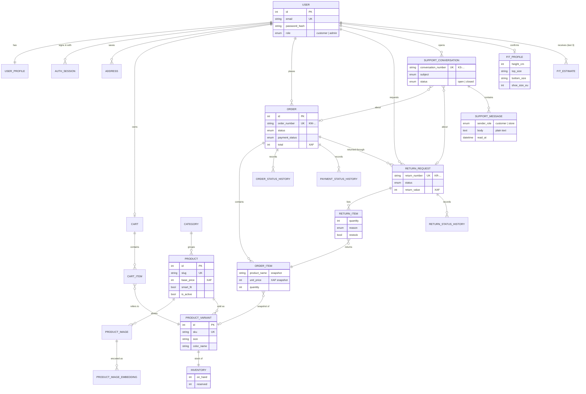

# Entity–relationship overview (v1.0.0-demo)

One PostgreSQL 18 database, 24 tables, all created by the Alembic migrations in
`backend/alembic/versions/`. Column-level details: [README.md](README.md).
This page lists the entities and relationships for a report diagram;
timestamps and secondary columns are left out on purpose.

## Relationships and rules

| Relationship | Cardinality | On delete | Notes |
| --- | --- | --- | --- |
| User – UserProfile | 1 : 1 | cascade | name, phone |
| User – AuthSession | 1 : n | cascade | one row per login; refresh-token id, revocation |
| User – Address | 1 : n | cascade | Cameroon delivery addresses, one default |
| User – Cart – CartItem | 1 : 0..1 : n | cascade | CartItem → ProductVariant |
| Category – Product | 1 : n | blocked (no action) | deactivation hides, nothing is hard-deleted in the admin |
| Product – ProductImage / ProductVariant | 1 : n | cascade | variant = colour × size (or one size) |
| ProductVariant – Inventory | 1 : 1 | cascade | `on_hand ≥ 0`, `reserved ≥ 0`; `available = on_hand − reserved` |
| ProductImage – ProductImageEmbedding | 1 : n (one per model) | cascade | 512-number OpenCLIP vector as bytes |
| User – Order | 1 : n | cascade | Order copies the delivery address |
| Order – OrderItem | 1 : n | cascade | immutable snapshot (name, SKU, size, colour, price); variant link set null if removed |
| Order – OrderStatusHistory / PaymentStatusHistory | 1 : n | cascade | audit trail with acting admin and notes |
| Order – ReturnRequest | 1 : n | cascade | only delivered orders; within 7 days of delivery |
| ReturnRequest – ReturnItem | 1 : n | cascade | ReturnItem → OrderItem (no catalog data copied) |
| ReturnRequest – ReturnStatusHistory | 1 : n | cascade | customer note + internal note |
| User – SupportConversation – SupportMessage | 1 : n : n | cascade | optional links to Order / ReturnRequest (set null) |
| User – FitProfile | 1 : 0..1 | cascade | confirmed sizes; estimated dimensions only if from photos |
| User – FitEstimate | 1 : n (last 3 kept) | cascade | derived numbers only, never images |
| VisualSearchIndexRun | — | — | log of index builds (not linked) |

Money is always an integer number of XAF francs. No table stores photos,
pose landmarks, payment card data or Mobile Money PINs.
